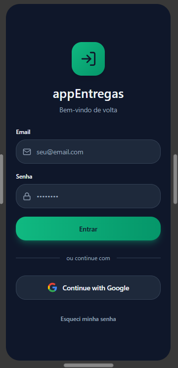
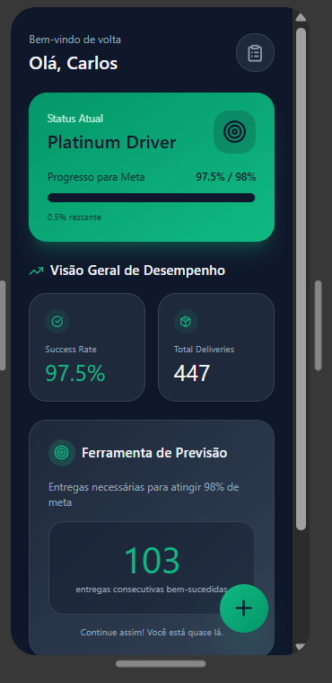
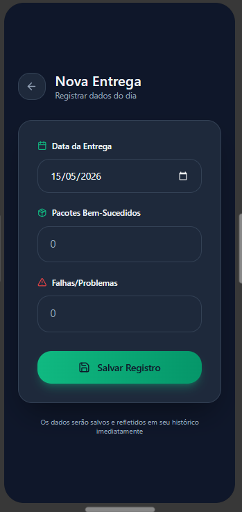
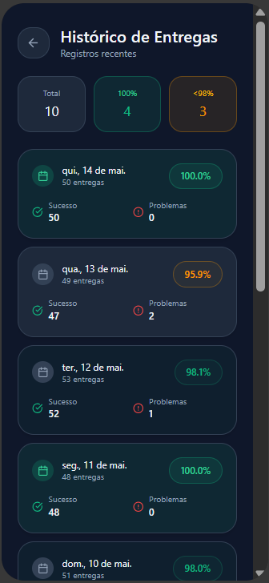

# 📦 Delivery Performance Tracker (Monitor de Metas)


-blue)


A Java application designed to help delivery drivers track, analyze, and recover their delivery performance based on real-world logistics metrics.

---

## 🚀 Overview

This project simulates a real logistics scenario where delivery performance must reach a **98% success rate** (Platinum Level). Built to solve a real-world problem faced daily by delivery drivers, it applies software engineering concepts to practical scenarios.

The system allows users to:
- Register daily deliveries (success/failures).
- Store historical data locally (CSV) with robust error handling.
- Calculate monthly performance dynamically.
- Predict mathematically how many perfect deliveries are needed to reach or maintain the 98% goal.

---

## 🎨 UI/UX Design (Mobile Concept)

To evolve the project from a CLI (Command Line Interface) to a full mobile experience, a high-fidelity prototype was developed using **Figma**. The design focuses on **Dark Mode** for driver comfort and quick data entry during shifts.

| Login Screen | Dashboard (Home) | New Entry | History |
| :---: | :---: | :---: | :---: |
|  |  |  |  |

> **Key Design Features:**
> - **Personalized Greeting:** User-centric dashboard.
> - **Goal Predictor:** Visual feedback on how many "clean" deliveries are needed.
> - **One-Handed Operation:** Floating Action Button (FAB) for quick logging.

---

## 🏗️ Software Architecture

The project was refactored from a simple script into a professional **Layered Architecture**, ensuring separation of concerns:

- **Model (`Entrega.java`):** Represents the domain entity. It uses **Restrictive Encapsulation** (Fail-Fast principle) to prevent invalid states (e.g., negative packages) via constructor validation.
- **Service (`EntregaService.java`):** The core business logic. It centralizes math calculations, applying the **DRY (Don't Repeat Yourself)** principle to avoid code duplication across metrics.
- **Repository (`EntregaRepository.java`):** Data access layer. Handles file I/O operations (CSV) safely, ignoring corrupted data lines without crashing the system.
- **UI (`Principal.java`):** The Command Line Interface (CLI). It is completely decoupled from business rules, focused solely on user interaction and input validation.

---

## 🛠️ Technologies & Best Practices

- **Java (Stream API, LocalDate)**
- **Object-Oriented Programming (OOP)**
- **Defensive Programming & Exception Handling:** Prevents crashes from invalid user inputs (`InputMismatchException`) or corrupted files.
- **Clean Code:** Clear method responsibilities and descriptive naming conventions.
- **UI/UX:** Prototyping in Figma with focus on Material Design 3.

---

## ▶️ How to Run

```bash
javac -d bin src/**/*.java src/*.java
java -cp bin Principal
```

---

## 📊 Example Output
--- MONTHLY PERFORMANCE ---
Total Deliveries: 94
Success Rate: 95.74%

⚠ ALERT: You need 8 perfect deliveries to recover your performance.

---

## 🎯 Purpose

This project was built to solve a real-world problem faced by delivery drivers, applying programming concepts to practical scenarios.

---

## 🚧 Roadmap & Next Steps
[x] Refactor architecture (Separation of Concerns).
[/] UI/UX Mobile Prototyping (Figma).
[ ] Implement Cloud Database integration (e.g., PostgreSQL or Firebase).
[ ] Build an API layer (Spring Boot).
[ ] Privacy by Design: Implement data hashing for sensitive information (LGPD compliance).
[ ] Develop Mobile Frontend (Android/Java).

---

## 👨‍💻 Author

João Vitor Hernandez  
🔗 https://www.linkedin.com/in/joão-vitor-hernandez-060831409

---

---

## 🇧🇷 Versão em Português

### 📦 Monitor de Metas - Logística
Uma aplicação em Java criada para ajudar entregadores a rastrear e recuperar sua performance baseada na meta de 98% (Nível Platina).

#### 🎨 Design UI/UX
O projeto evoluiu para um conceito mobile moderno em **Dark Mode**, focado em usabilidade prática para o dia a dia na rua. O protótipo inclui login social, dashboard de metas com "Olá, Nome" e ferramenta de previsão de entregas necessárias.

#### 🏗️ Arquitetura e Engenharia
- **Model:** Validação de regras de negócio na origem.
- **Service:** Projeções matemáticas e lógica de recuperação.
- **Repository:** Isolamento de leitura de arquivos CSV.
- **UI:** Interface de terminal independente das fórmulas.
