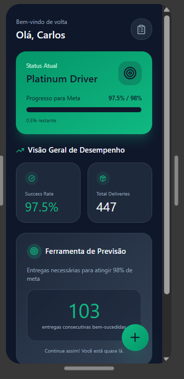
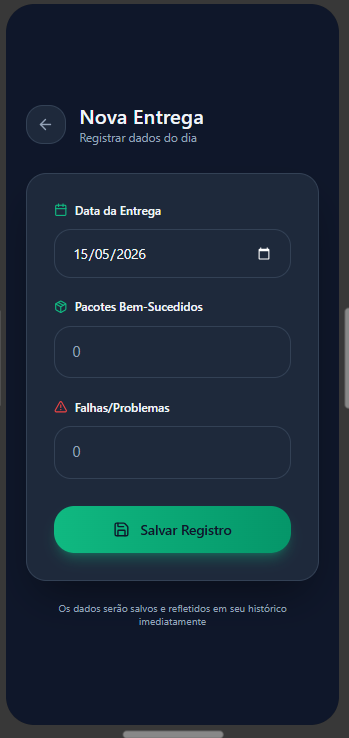
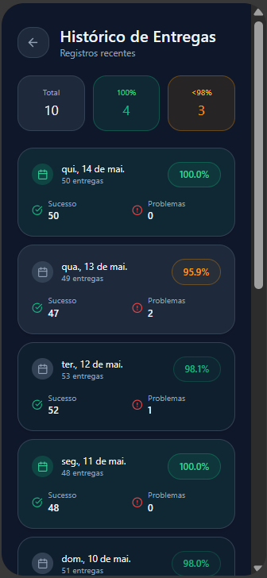

# 📦 Delivery Performance Tracker (Monitor de Metas)


-blue)


A secure, database-driven Java application designed to help delivery drivers track, analyze, and recover their delivery performance based on real-world logistics metrics.

---

## 🚀 Overview

This project simulates a real logistics scenario where delivery performance must reach a **98% success rate** (Platinum Level). Originally a basic script, it has evolved into a robust, secure, multi-user system powered by a relational database and cryptographic security.

The system allows users to:
- **Secure Authentication:** Create accounts and log in securely with password encryption.
- **Isolated Driver Data:** Multi-user support ensures each driver only views and manages their own delivery history.
- **Smart Tracking:** Register or update daily deliveries (successes/failures). If an entry already exists for a given date, the system intelligently updates it instead of creating duplicates.
- **Mathematical Predictor:** Dynamically calculate monthly performance and project exactly how many perfect deliveries are needed to reach the 98% target.
- **Professional PDF Reports:** Export detailed monthly statistics into a well-formatted PDF document.

---

## 🎨 UI/UX Design (Mobile Concept)

To envision the project beyond the CLI (Command Line Interface), a high-fidelity prototype was developed using **Figma**. The design focuses on **Dark Mode** for driver comfort during night shifts and quick data entry.

| Login Screen | Dashboard (Home) | New Entry | History |
| :---: | :---: | :---: | :---: |
|  |  |  |  |

---

## 🏗️ Software Architecture

The project follows a solid **Layered Architecture** with clean separation of concerns:

- **Model (`Usuario.java`, `Entrega.java`):** Represents domain entities. Uses Restrictive Encapsulation (Fail-Fast principle) to block invalid inputs, such as negative package counts, at the constructor level.
- **Repository (`UsuarioRepository.java`, `EntregaRepository.java`, `ConexaoSQLite.java`):** Data Access Object (DAO) layer. Replaced unstable CSV file handling with robust **SQLite database integration via JDBC**, protecting the system against SQL Injection using `PreparedStatement`.
- **Service (`EntregaService.java`, `SenhaService.java`, `RelatorioPdfService.java`):** Core business logic layer. Handles performance metrics, target projections, password hashing using **BCrypt**, and document rendering via **OpenPDF**.
- **UI (`Principal.java`):** The interactive terminal view (CLI). Fully decoupled from business formulas, managing state machine sessions (Logged out / Logged in menus) and inputs safely.

---

## 🛠️ Technologies & Best Practices

- **Java SE** (Stream API, LocalDate, Lambda expressions)
- **SQLite Database** & JDBC (Java Database Connectivity)
- **BCrypt Hashing:** Secure password storage using strong salted hashing algorithms.
- **OpenPDF / Openhtmltopdf:** Professional generation of dynamic PDF reports.
- **Defensive Programming:** Robust exception handling preventing crashes from bad terminal inputs (`InputMismatchException`, `DateTimeParseException`) or SQL states.
- **Clean Code & OOP:** Focus on the DRY (Don't Repeat Yourself) principle and single-responsibility components.

---

## ▶️ How to Run

Make sure you have the required external `.jar` libraries for SQLite, BCrypt, and OpenPDF in your classpath (e.g., inside a `lib` folder):

```bash
# Compile
javac -cp "lib/*" -d bin src/main/java/**/*.java src/main/java/*.java

# Run
java -cp "bin:lib/*" Principal
```
(Note: On Windows, use a semicolon ; instead of a colon : to separate path dependencies in the classpath).

---

## 📊 Example Output
--- MONHLY PERFORMANCE SUMMARY ---
Driver: joao
Total Packages Handled: 150
Current Success Rate: 96.00%

⚠ ALERT: You need 15 perfect deliveries to recover your Platinum Level (98%).
----------------------------------
[System] PDF Report successfully generated: Relatório_Entregas_joaovitor_5_2026.pdf

---

## 🎯 Purpose

This project was built to solve a real-world problem faced by delivery drivers, applying programming concepts to practical scenarios.

---

## 🚧 Roadmap & Next Steps
- [x] Refactor architecture (Separation of Concerns).
- [x] Migrate from CSV files to a relational local Database (SQLite).
- [x] Privacy by Design: Secure authentication with BCrypt hashing (LGPD compliance).
- [x] Implement duplicate prevention (Smart SQL UPSERT/Update logic).
- [x] Implement professional Document Exporting (PDF Service).
- [ ] UI/UX Mobile Prototyping (Figma).
- [ ] Build an API layer (Spring Boot REST API).
- [ ] Develop the Mobile Frontend (Android / Flutter).

---

## 👨‍💻 Author

João Vitor Hernandez  
🔗 https://www.linkedin.com/in/joão-vitor-hernandez-060831409

---

---

## 🇧🇷 Versão em Português

### 📦 Monitor de Metas - Logística
Uma aplicação em Java profissional criada para ajudar entregadores de logística a rastrear, analisar e recuperar sua performance de entregas baseada na meta corporativa de 98% de sucesso (Nível Platina).

### 🛡️ O que mudou na nova versão?
O projeto deixou de ser um script local que lia arquivos de texto básicos (CSV) e se tornou um ecossistema seguro e corporativo:
- Segurança de Dados (LGPD): Implementação de controle de usuários com senhas criptografadas via algoritmo BCrypt (salvamento em formato Hash).
- Banco de Dados Relacional: Integração total com SQLite via JDBC, garantindo persistência robusta, integridade de dados e proteção contra SQL Injection.
- Ambiente Multiusuário: Dados totalmente isolados. Cada motorista só visualiza e edita seu próprio histórico de entregas.
- Lógica Inteligente: Sistema integrado de atualização diária. Registrar novos dados em uma data existente atualiza o registro atual automaticamente.
- Relatórios em PDF: Módulo de exportação automatizada para geração de relatórios mensais diagramados e profissionais.

#### 🎨 Design UI/UX
O projeto evoluiu para um conceito mobile moderno em **Dark Mode**, focado em usabilidade prática para o dia a dia na rua. O protótipo inclui login social, dashboard de metas com "Olá, Nome" e ferramenta de previsão de entregas necessárias.

#### 🏗️ Arquitetura e Engenharia
- **Model:** Entidades puras (Usuario e Entrega) protegidas por encapsulamento restritivo (princípio Fail-Fast).
- **Service:** Concentração das regras de negócio, criptografia (SenhaService), projeções matemáticas de recuperação de metas (EntregaService) e renderização de documentos (RelatorioPdfService).
- **Repository:** Camada de persistência (ConexaoSQLite, UsuarioRepository, EntregaRepository) focada em operações ACID seguras no banco de dados.
- **UI:** Terminal interativo estruturado em máquina de estados para gerenciar o fluxo antes e depois da autenticação do motorista.